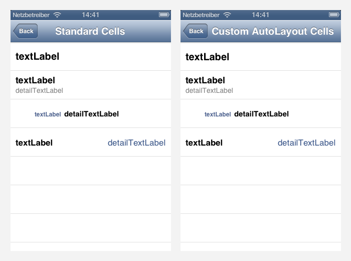
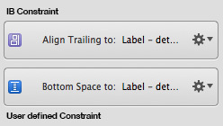
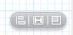
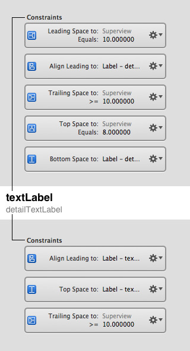
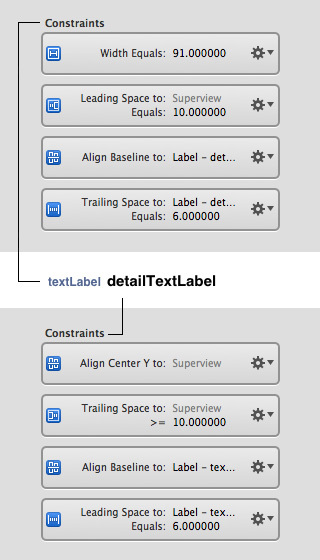
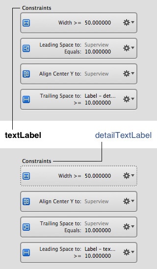

### Creating the four UITableViewCellStyles using AutoLayout

Are you one of those persons, who did understand the Spring & Struts layout model perfectly. One of those, who was more likely to use some additional container views to reach a specific layout than starting to learn AutoLayout? I am one of them. And still, for simple layouts, I think the Spring & Struts model is both faster and easier.

But if it comes to more complex layouts, the AutoLayout system can save you a lot of code. So in this article I want give a basic introduction to AutoLayout with InterfaceBuilder by showing, how to create the four well known standard UITableViewStyles of a UITableViewCell using AutoLayout:

  
*(Left original, right custom layouting)*

### AutoLayout with InterfaceBuilder

Before discussing the specific constraints, here are three general hints, when using IB for AutoLayout.

1. Your target should always be, to remove all automatic (implicit) constraints from Interface Builder. They are violet instead of blue, as user defined ones (explicit) are. **Get rid of the violet ones!** If you have left blue constraints only, you defined a complete layout, which correctly defines position and size of the view.  
   
1. If you want a label (or another view) to resize according to its contents, e.g. the text of a label, you need to have no fixed width or fixed height constraints. (Depending which size should be flexible). To get rid of width and height constraints, you can simply select a view and choose **Editor > Size To Fit Content** (⌘=)
1. If you are totally new to AutoLayout, the following buttons are your new best  friends. Use them to create constraints in Interface Builder:  
   

I do not show the basic UITableViewCellStyleDefault in my examples. You can figure it out yourself. But let's have a look at the other three layouts starting with UITableViewCellStyleSubtitle. 

### UITableViewCellStyleSubtitle

This is a quite static layout. Two labels, one on the top, one on the bottom. But we want the length to be always as long as the text is, not any longer. Also the maximum length should be no longer than the cell itself minus 10px margin. How can we achieve this? Here is an overview of all constraints for both labels:

As you can see there are no violet constraints left. I will shortly explain them all. On the *textLabel* we have:

1. 10px margin to the left view border
1. Align left corner of first label with left corner of second label
1. Margin to the right view border should be 10px or more
1. 8px margin to the top view border
1. 0px margin between both labels

And on the *detailTextLabel*:

1. The same as 2. from the first label. (Align left corner of first label with left corner of second label)
1. The same as 5. from the first label: (0px margin between both labels)
1. Also 10px margin to the left view border

### UITableViewCellStyleValue2

We have a label with a fixed width on the left and a flexible width label on the right. As in the last layout, the right label should not grow any larger than the cell itself (minus 10px margin). These are the constraints:

On the *textLabel*, we have:

1. A fixed width of 91px
1. 10px margin on the left
1. Baseline alignment with the detailLabel
1. 6px margin to the detailLabel

On the *detailTextLabel*, we have:

1. Vertical centering in superview
1. A minumum of 10px margin to the right
1. Same as 3. from the textLabel (Baseline alignment with the detailLabel)
1. Same as 4. from the textLabel (6px margin to the textLabel)

### UITableViewCellStyleValue1

This is the most flexible one. Because both labels are next to each other, but they can both have any size they want (within the cell bounds). So if the first label needs most of the space, the second one shrinks and vice versa. These are the constraints:

On the *textLabel*, we have:

1. A minimum width of 50px
1. 10px margin to the left
1. Vertical centering in superview
1. At least 10px spacing to the detailLabel

On the *detailTextLabel*, we have:

1. Also a minimum width of 50px, but with half the priority of the textlabel. So the textLabel will always get most of the space, when needed.
1. Vertical centering in superview
1. 10px margin to the right
1. The same as 4. from the textLabel (At least 10px spacing to the textLabel)

### Conclusion

In the end, if you did understand the system once and know the buttons in InterfaceBuilder it is straight forward and you can create layouts, that would have needed code before AutoLayout. It's a very strong system. And if you do it with IB it is easier to debug and create, than by code. I recommend to always use IB. But there are layouts, where you need to use code. E.g. if you want to have relative constraints like "1/2 of the height", or aspect ratio stuff like "height=width", or to do animations, etc.

#### Remember: Get rid of all violet constraints!
